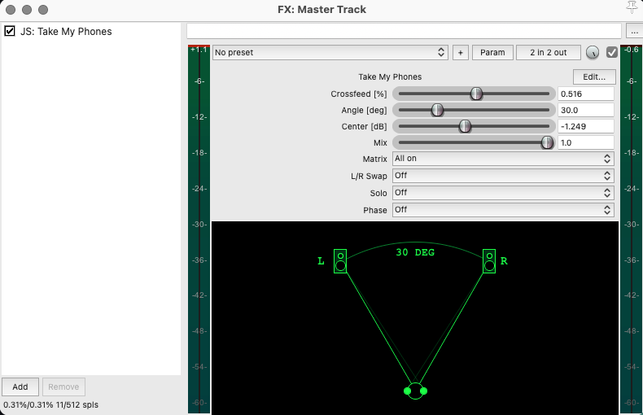

## REAPER JSFX Scripts

### Take My Phones (Crossfeed)

Functional emulation of the Matrix section of the SPL Phonitor 3.

Controls:

- CROSSFEED: inter-channel bleed amount (ILD, interaural level difference)
- ANGLE: virtual speaker angle simulation (ITD, interaural time difference)
- CENTER: attenuation of the phantom center (mid in M/S)
- MIX: dry/wet of the entire matrix
- MATRIX: Cr/A = crossfeed+angle only / Off = bypass / All on = full matrix
- L/R SWAP: swap left and right channels before processing
- SOLO: monitor one channel (L or R) sent to both ears
- PHASE: invert phase on selected channel (L or R)

Not affiliated with SPL. Functional approximation, not a circuit clone.

